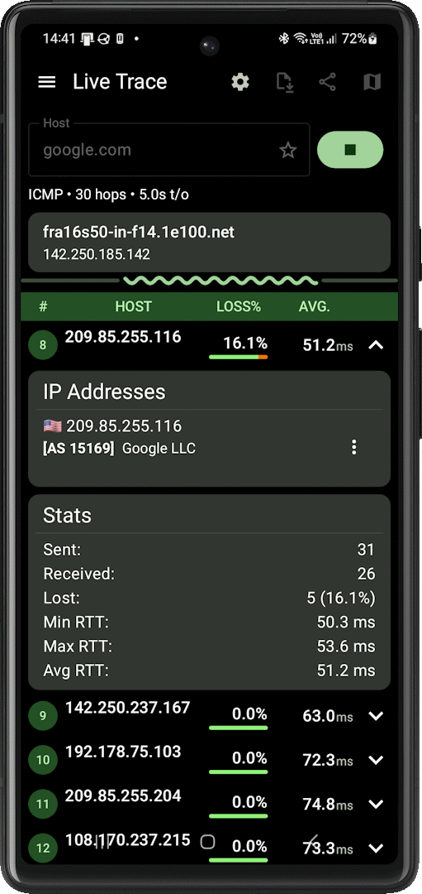

<br/>

  
# icmpenguin

**icmpenguin** is an Android library for network diagnostics, providing tools for ping and traceroute operations. It combines Kotlin for high-level asynchronous logic using coroutines and native C++ code via JNI for low-level socket handling, supporting both IPv4 and IPv6. This allows bypassing Java/Android limitations for raw sockets like ICMP.

The library is licensed under the Apache License 2.0 and is designed for easy integration into Android applications, such as network utilities or monitoring tools.

# Key Features

- **Ping Functionality:** Send ICMP echo requests with customizable parameters like TTL, timeout, packet size, interval, and data pattern.
- **Traceroute Functionality:** Trace routes using ICMP or UDP probes, with support for stepped or concurrent strategies, port selection, and MTU discovery.
- **Asynchronous Operations:** Built on Kotlin Coroutines for non-blocking I/O, ensuring smooth integration with Android UI threads.
- **IPv4/IPv6 Support:** Automatic address resolution and protocol handling.
- **MTU Discovery:** Dynamically adjust packet sizes to detect path MTU issues during traceroute.
- **Customizable Strategies:** For traceroute, choose between stepped (with concurrency limits) or concurrent probing.
- **Detailed Results:** Probe results include success metrics (RTT, TTL), errors (e.g., host unreachable with offender IP), and timeouts.
- **Thread-Safety:** Uses atomics and safe concurrency in both Kotlin and C++ layers.
- **JNI Integration:** Native code handles socket creation, packet sending/receiving, and error processing efficiently.
- **Performance:** Native C++ core minimizes overhead for socket operations, making it faster than pure Java alternatives.

# Device Compatibility

**icmpenguin** uses low-level socket APIs that require direct network stack access. While fully supported on **physical Android devices**, the **Android Emulator** has known limitations with ICMP sockets.

> [!IMPORTANT]
> **Always test network functionality on physical devices.** Use the emulator primarily for UI development and logic testing.

# Requirements
- Android API Level 24+ (Android 7.0+)
- Internet permission in manifest:
```xml
<uses-permission android:name="android.permission.INTERNET" />
```

# Setup
You can add this library to your project using Gradle.
```groovy
dependencies {
  implementation("me.impa:icmpenguin:1.0.0-rc.1")
}
```

# Building from Source
Clone the repository:
```bash
git clone https://github.com/impalex/icmpenguin.git
```
Build with Gradle:
```bash
./gradlew build
```

# Usage
## Ping Example

Use the ``Pinger`` class to perform ping operations. Results are delivered via a callback.
```kotlin
import me.impa.icmpenguin.ping.Pinger

suspend fun pingHost(host: String) {
    val pinger = Pinger(
        host = host,
        timeout = 3000,
        maxPingCount = 4,
        interval = 1000
    )
    
    pinger.ping { result ->
        when (result) {
            is ProbeResult.Success -> {
                println("Reply from ${result.remote}: time=${result.elapsedUsec}μs ttl=${result.ttl}")
            }
            is ProbeResult.Timeout -> {
                println("Request timed out for ${result.remote}")
            }
            is ProbeResult.HostUnreachable -> {
                println("Host ${result.remote} unreachable via ${result.offender}")
            }
            else -> println("Result: $result")
        }
    }
}
```

## Traceroute Example

Use the ``SimpleTracer`` class for simplified traceroute. Hop statuses are updated asynchronously.
```kotlin
import me.impa.icmpenguin.trace.SimpleTracer

suspend fun traceRoute(host: String) {
    val tracer = SimpleTracer(
        host = host,
        probeType = ProbeType.ICMP,
        maxHops = 30,
        probesPerHop = 3,
        timeout = 2000
    )
    
    tracer.trace { hopStatus ->
        println(hopStatus)
    }
}
```

## Advanced Ping Configuration

```kotlin
val pinger = Pinger(
    host = "google.com",
    ttl = 64,                           // Time To Live
    timeout = 5000,                     // Response timeout in ms
    maxPingCount = Pinger.INFINITE,     // Infinite pings (until stopped)
    interval = 1000,                    // Time between pings
    probeSize = 56,                     // Packet size including headers
    pattern = "PING1234".toByteArray()  // Custom payload pattern
)
```

## Custom Traceroute Strategy

```kotlin
val tracer = Tracer(
    host = "github.com",
    probeType = ProbeType.UDP,
    traceStrategy = TraceStrategy.Concurrent(
        maxHops = 30,
        cycles = 3,              // Repeat entire trace 3 times
        interval = 2000L         // Time between cycles
    ),
    portStrategy = PortStrategy.Sequential(start = 33434),
    probeSize = ProbeSize.MtuDiscovery,  // Automatically discover MTU
    timeout = 3000
)

// Track individual probe results
tracer.trace { hop, result ->
    println("Hop $hop: $result")
}
```

# Documentation

For more information, please refer to the [documentation.](https://impalex.github.io/icmpenguin/)

# Showcase

### TraceMeister
[](assets/showcase/tracemeister.png)

**TraceMeister** is an Android application for network diagnostics (ping, traceroute, live trace) based on **icmpenguin**. It demonstrates the high performance of the library on mobile devices without root privileges.

Available on [Google Play](https://play.google.com/store/apps/details?id=me.impa.tracemeister.free.orbit?utm_source=github&utm_medium=readme).

>[!TIP]
> If you use **icmpenguin** in your project, add it here via pull request!

# Contributing

Contributions are welcome! Please submit pull requests for bug fixes or new features.

# License
```
 Copyright (c) 2025-2026 Alexander Yaburov
 
 Licensed under the Apache License, Version 2.0 (the "License");
 you may not use this file except in compliance with the License.
 You may obtain a copy of the License at
 
 http://www.apache.org/licenses/LICENSE-2.0
 
 Unless required by applicable law or agreed to in writing,
 software distributed under the License is distributed on an
 "AS IS" BASIS, WITHOUT WARRANTIES OR CONDITIONS OF ANY
 KIND, either express or implied.  See the License for the
 specific language governing permissions and limitations
 under the License.
 ```
 
 #
 
 Penguin loves packets! 🐧📦